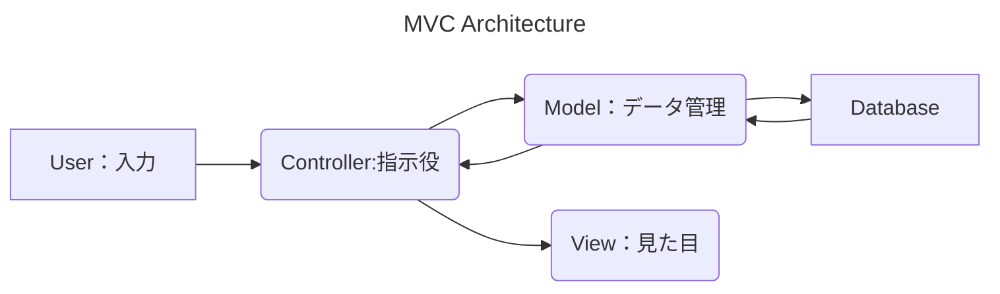
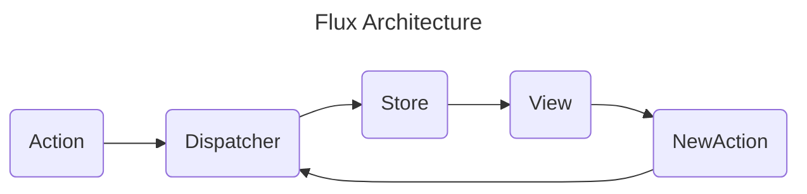

    
コンピューターサイエンスはコンピューターの仕組みや技術を知識体系としてまとめたものです。パソコンやプログラミングで仕事をする上で知っておくべき知識中心に紹介します。


# アルゴリズムとデータ構造


アルゴリズムは問題を解決するための手順や方法を示します。一方、データ構造はデータを効率的に管理・格納するための方法を提供します。例えば、配列、リスト、スタック、キュー、ツリー、グラフなどがあります。これらは、効率的なアルゴリズムの実装に不可欠です。


## データ構造


データ構造は、データを処理しやすい形に整えた構造のことです。アルゴリズムが料理しやすいようにデータを下処理するようなイメージですね


- **配列（Array）**：一列に連なったデータのまとまりです。連続したメモリに格納されます。
- **連想配列（Key-Value）**：関連性のある要素どうしを結びつけるデータ構造です。その際、標識となる要素のことを、**キー(key)**、対応する要素のことを**値(value)**と言います。DictionaryだったりHashTableだったり別名があります。
- **スタック（Stack）**：**Push**で末尾に要素の追加をして、**Pop**で末尾の要素の削除をします。
- **キュー（Queue）**：**Enqueue**で末尾に要素の追加をして、**Dequeue**で先頭の要素の削除をします。
- **グラフ（Graph）**:オブジェクトやネットワークの関係性を表現するデータ構造で、**vertex/node**とそれらを結ぶ **edge/link**（辺）から構成されます。edge/linkには**weight（重み）**と**direction（方向）**があります。
- **ツリー（Tree）**：木のような、階層的なデータ構造をあらわします。一つのルートノードから始まり、複数の子ノードが連なります。
- その他：[Heap](https://medium.com/@yasufumy/data-structure-heap-ecfd0989e5be)、[Set](https://ja.wikipedia.org/wiki/%E3%82%BB%E3%83%83%E3%83%88_(%E6%8A%BD%E8%B1%A1%E3%83%87%E3%83%BC%E3%82%BF%E5%9E%8B))、[B-Tree](https://ja.wikipedia.org/wiki/B%E6%9C%A8)、[LinkedList](https://ja.wikipedia.org/wiki/%E9%80%A3%E7%B5%90%E3%83%AA%E3%82%B9%E3%83%88)

## アルゴリズム


アルゴリズムは、データを処理するルールのことです。一言でいうと簡単ですが、１＋１のような簡単なアルゴリズムから、複雑な問題をシンプルに解ける賢いアルゴリズムまで様々あります。ここでは基本的にはコンピューターが解きやすい問題を中心に取り扱います。

- **ソート（並び替え）**：バブルソート、クイックソート、マージソート、選択ソート、挿入ソート、ヒープソート
- **サーチ（探索）**：線形探索、二分探索（Binary Search）、四分木探索（Quadtree Search）、八分木探索（Octree Search）、文字列探索、ハッシュ関数
- **グラフアルゴリズム**：グラフ理論に基づくアルゴリズムダイクストラ法（最短経路問題）、クラスカル法（最小全域木問題）、深さ優先探索（DFS）、幅優先探索（BFS）
- **最適化アルゴリズム**:：特定の条件下で最適な解を見つけるアルゴリズム。例: 線形計画法、遺伝的アルゴリズム、シミュレーテッド・アニーリングなど。
- **機械学習アルゴリズム**：機械学習で使われるアルゴリズム。k近傍法、決定木、ニューラルネットワーク、SVM、Transformerなど

# ハードウェア


## 半導体と論理回路


半導体（トランジスタ）は計算機を作る重要なパーツになります。


電流を流す、流さない（０と１）を制御できるので、**論理回路**（AND、OR、NOT、XOR）を組むことができます。この論理回路を使うと、四則演算（+−×÷）を行うことができます。


https://kouyama.sci.u-toyama.ac.jp/main/education/2012/isintro/pdf/text/text06.pdf


http://www.johoka.info/index.php?action=common_download_main&upload_id=1652&nc_session=21b82e29e81f5c4d7366a57118840461


## CPU（Central Processing Unity）


CPUは半導体の集合体です。主な機能は、シンプルには数値や論理的計算をすることなのですが、その計算により、プログラムの命令を実行し、コンピュータの各部分を制御することができます。。これにより、コンピュータは計算、データの処理、タスクの実行など、多様な作業をこなすことができます。


CPUは一般に以下の主要なコンポーネントから構成されています

1. **演算処理ユニット（ALU）**：数学的な計算や論理的な操作を行います。
2. **制御ユニット（CU）**：プログラムの命令を解読し、他のコンピュータ部品に指示を出す役割を担います。
3. **レジスタ**：命令の実行中にデータを一時的に保存するための小さな記憶領域です。
4. メモリユニット：メモリとやり取りをしてくれる部品です

|  単語       | 意味                                          |
| --------- | ------------------------------------------- |
| クロック      | 一秒あたりの命令処理数。電気信号の周波数に準じている。                 |
| マルチコア     | 複数の処理を同時に行う能力。小さいCPUが沢山あるイメージ。              |
| マルチスレッド   | １つのコアで複数の処理を扱う能力。                           |
| キャッシュサイズ  | レジスタより多くの情報を一時記憶するCPUに内蔵されているメモリ            |
| アーキテクチャ   | 命令セット（計算）やレジスタの仕様などの設計方法。
x86,x64,ARMなどがある。 |
| ビット（bit）  |  0か1（二進数）の値を取る、情報の最小単位。                     |
| バイト（byte） | 1byte = 8bit。$2^8$=256 の情報を持つことができる。        |


### CPUの動作の仕組み


CPUの動作は基本的に「フェッチ（Fetch）、デコード（Decode）、実行（Execute）」の3ステップのサイクルで成り立っています。これを理解することで、CPUがどのようにして命令を処理するかが分かります。


1. **フェッチ（Fetch）**:
	- このステップでは、CPUはメモリから次に実行すべき命令を取得します。命令は通常、バイナリコード（0と1のシーケンス）の形で格納されています。
	- プログラムカウンタ（PC）というレジスタが、次に実行する命令のメモリアドレスを保持しており、CPUはこのアドレスから命令を「フェッチ」します。
2. **デコード（Decode）**:
	- 取得した命令は、制御ユニットによって解読されます。これは、バイナリコードをCPUが理解できる具体的な指示に変換するプロセスです。
3. **実行（Execute）**:
	- 解読された命令は、次にCPU内の適切な部分で実行されます。例えば、算術論理ユニット（ALU）では数学的な演算が、レジスタではデータの読み書きが行われます。
	- 例えば、「加算」や「データの移動」といった操作がここで特定されます。
	- 実行フェーズが完了すると、CPUは結果をメモリに書き戻すか、または内部で保持します。

## GPU（Graphic Processing Unity）


GPUは、主に画像処理とレンダリングに特化したコンピュータのプロセッサです。もともとはビデオゲームや3Dグラフィックスを高速に処理するために設計されましたが、その高い計算能力と並列処理能力により、現在ではビデオ編集、画像処理、機械学習、ディープラーニングなど幅広い分野で使用されています。


GPUは数百から数千の小さなコアを持っており、これにより複数の計算処理を同時に行うことができます。この並列処理能力は、特に大量のデータを扱う作業や、同じ処理を多数のデータポイントに適用するような作業に適しています。


### GPGPU


GPGPU（General-Purpose computing on Graphics Processing Units）はGPUの計算資源を汎用的に使えるようにする機能です。これは、グラフィックス以外の計算作業、特にパーティクル計算や機械学習などのタスクに応用されています。


## メモリ


そもそもメモリとは「Random Access Memory（RAM）」のこと。 主記憶装置とも呼ばれ、CPUと直接つながっていて、**CPUが計算や処理をする場合に、一時的に情報を記憶しておく場所**の事です。 パソコンの心臓部であるCPUと超高速でやり取りしながらデータの処理を行っているのです。


このメモリはデータやプログラムコードの一時的な保存場所として使用され、CPUが直接アクセスしてデータの読み書きを行います


*メモリはよく机の上に例えられる。*


RAMの速度はコンピュータの全体的なパフォーマンスに大きな影響を与え、メモリ容量が多いほど、より多くのプログラムやデータを同時に処理することができます。


現在RAMは半導体製品であることがほとんどで、電源が切れればデータも消える揮発性メモリとなります。


# OS（オペレーティングシステム）


OSは、**ハードウェアとソフトウェアの仲介**をして両方を管理するシステムソフトウェアです。リソース管理、ファイルシステム、セキュリティ、プロセス管理などの重要な機能を提供します。OSがやっていることをざっくりと理解しておきましょう。


ハードウェアとソフトウェアをつなぐ役割。


## ファームウェア（BIOS)


コンピュータの電源が入ると、BIOSは最初に実行されるファームウェアです。BIOSはパワーオン・セルフテスト（POST）を行い、ハードウェアが正常に動作しているかをチェックします。


BIOSは主にハードウェアの初期化とブートプロセスの管理に関与し、カーネルはシステムが起動した後の全体的な管理とリソースの調整を行います。


BIOSがシステムの初期化とハードウェアの設定を完了した後、ブートローダーを経由してOSのカーネルに制御を移します。カーネルはその後、OSの残りの部分をロードし、システムの起動を完了します。


## カーネル


カーネルはOSの根幹を担う機能群のことです。以下の機能があります。

- **ハードウェア管理**：ハードウェアリソース（CPU、メモリ、ディスクストレージ、入出力デバイスなど）の管理と抽象化を行います。
- **プロセス（CPU）管理**：ユーザーが与えた一連のタスク（プロセス）を管理します。開始・終了・処理のスケジューリングなど。
- **メモリ管理**：各プロセスにメモリを割り当てたり、使ってないメモリを最適化したり。
- **システムコール**：カーネルの機能を安全に実行させるためのインターフェースです。

## シェル（CLI）


シェルは、ユーザーがコンピューターと対話するためのインターフェースを提供します。いわゆるコマンドプロンプトやTerminalのことで、ユーザーが命令し易い言語を使って、カーネルに命令を実行させたり、プログラムを実行したりすることができます。


## システム・ソフトウェア


システムソフトウェアは **OS が提供しているプログラム群**です。シェルから呼び出したり、他のプログラムから呼び出したりします。

1. **ファイル管理ツール**：ファイルの作成、編集、削除、コピー、移動などを行うためのプログラム。
2. **システム監視ツール**：システムのパフォーマンス、リソース使用状況、セキュリティイベントなどを監視するためのプログラム。
3. **デバイスドライバ**：ハードウェアデバイスとOS間の通信を可能にするソフトウェア。
4. **ネットワーク管理ツール**：ネットワーク接続や設定を管理するためのプログラム。
5. **セキュリティツール**：ウイルス対策、ファイアウォール、アクセス制御などのセキュリティ関連のプログラム。

# ネットワーク・通信


コンピューターネットワークは、異なるコンピューターシステムやデバイスを接続して通信を可能にします。これには、LAN、WAN、インターネットなどが含まれます。プロトコル（TCP/IP、HTTPなど）やデータ転送技術が基礎となります。


## パケット通信


データを特定のサイズに小分け（128バイト）にして通信をする仕組みです。通信の根幹を支える技術で、より効率よく確実にデータを届けられる仕組みになっています。


パケットは、ヘッダーとボディに分かれています。ヘッダーには、送信元と目的地のアドレス、順序番号、エラーチェック情報などが含まれています。ボディにはデータの本体が入っています。


## ネットワークのレイヤー


TCP/IPモデルはインターネットの基盤となるプロトコルスタックのモデルで、4層からなります。


| 階層 | TCP/IP プロトコルスタック | プロトコル          |
| -- | ---------------- | -------------- |
| 4  | アプリケーション層        | HTTP OSC       |
| 3  | トランスポート層         | TCP UDP        |
| 2  | インターネット層         | IP port        |
| 1  | ネットワークインターフェース層  | Ethernet, Wifi |


TCP/IPは、IPアドレスを住所として扱ってネットワーク通信をする仕組み全般のことです。現在私達が使っているインターネットのほとんどは、この仕組みを使っています。


## ネットワークプロトコル


デバイス間の通信をするためのルールのことです。データの形式、送受信方法、エラー処理などを定義し、異なるデバイスやシステム間で通信するための規格となります。


以下に代表的なプロトコルを説明します。


### TCP/UDP

- **TCP(Transmission Control Protocol)**: データを損失なく確実に目的地に届けられる通信方法です。確実にデータを届けた確認をするので、信頼性が高いのが特徴です。
- **UDP (User Datagram Protocol)**: データをただ目的地に送り続けるような通信方法です。伝送速度と頻度が高いのが特徴です。

### HTTP（Hypertext Transfer Protocol）


よくインターネットでウェブサイトを閲覧するときに使われるプロトコルです。基本的に文字列


ClientがServerにデータをRequestをして、ServerがResponseを返す。というやり取りを行います。


リクエストヘッダーはこのファイルをこの形式で欲しいです、って要求しています。


```yaml
GET /home.html HTTP/1.1
Host: developer.mozilla.org
User-Agent: Mozilla/5.0 (Macintosh; Intel Mac OS X 10.9; rv:50.0) Gecko/20100101 Firefox/50.0
Accept: text/html,application/xhtml+xml,application/xml;q=0.9,*/*;q=0.8
Accept-Language: en-US,en;q=0.5
Accept-Encoding: gzip, deflate, br
Referer: https://developer.mozilla.org/testpage.html
Connection: keep-alive
Upgrade-Insecure-Requests: 1
If-Modified-Since: Mon, 18 Jul 2016 02:36:04 GMT
If-None-Match: "c561c68d0ba92bbeb8b0fff2a9199f722e3a621a"
Cache-Control: max-age=0
```


そのあと、レスポンスでデータの中身とメタ情報がセットで送られてきます。


```yaml
HTTP/1.x 200 OK
Date: Sat, 16 Nov 1990 00:01:45 GMT
Server: Apache / 1.3.27
Connection: close
Expires: Sat, 16 Nov 2023 00:01:25 GMT
Cache-Control: max-age=3600, public
Content-Type: text/html; charset=UTF-8
Last-Modified: Sat, 28 Nov 2009 03:50:37 GMT
Content-Encoding: gzip

<html><head></head><body>hello world</body></html>
```


### OSC （Open Sound Control）


非常なシンプルなUDPのプロトコルで、音楽関連にはじまり、簡易なデータ通信の実装などに使われます。


メッセージ部分とデータ部分にわかれていて、それぞれ、スラッシュ区切りの文字列と４つの型の配列でデータを構成します。


```plain text
message(string) arguments(int,float,string,byte[])
/cube/position 1.00 1.00 1.00 
```


これは個人的イメージですが、UDPを取り扱いやすいようにラップしてあげたようなプロトコルだと思っています。


# ソフトウェア設計


この項ではソフトウェア設計についてまとめます。


## オブジェクト指向＆関数プログラミング


プログラミングの大きなジャンルにこの２つのパラダイム（設計方法）があります。それぞれ突き詰めていくと、プログラミングの本質を探っていくような作業でかなり奥深い体験なのですが、ここでは大切な設計の基本理念とそのサンプルコードを紹介します。


### オブジェクト指向プログラミング


オブジェクト指向は現在最もよく使われているプログラミングのパラダイム（設計方法）です。オブジェクト指向には以下の３つの大きな特徴があります。

- **カプセル化**：データとメソッドを一つのクラスにまとめ、外部から中身を隠して処理を実行させることができます。
- **継承**：親クラスのデータやメソッドを別の子クラスが受け継ぐことができます。
- **ポリモーフィズム**：異なるクラスの機能が同じインターフェースやメソッド名でアクセスできるようにすること。

吠える犬の例でサンプルコードを書きます。


```c
class Animal{
	string name;
	int age;
	Animal(string name, int age){
		name = name;
		age = age;
	}
	void speak(){
		printf("%s（%d歳）は鳴く", name, age);
	}
}
//Animalクラスの継承
class Dog: public Animal{
	Dog(string name, int age): Animal(name, age){}
	void speak(){
			printf("%s（%d歳）はワンワンと吠える！", name, age);
  }
}
//クラスをインスタンス化
Dog dog1 = Dog("太郎", 3)
//Speakというメソッドでも、Dogクラスではわんわんと鳴く事ができる。これがポリモーフィズム。
dog1.speak(); //太郎（３歳）はワンワンと吠える！
```


オブジェクト指向はプログラミングを学ぶ上でかなり最初の方に習う概念ですが、突き詰めていくとかなり複雑な概念になっていきます。かなり柔軟かつ堅牢な設計にできる一方、システムが肥大化するに連れて、必要な知識と複雑性が増してくるので、より高度な脳みそが必要になってくる点に注意です。


### 関数型プログラミング


関数型プログラミングは、数学の関数の定義や呼び出しに重点を置いたプログラムの設計をする方法です。以下の特徴があります。

- **純粋関数**：同じ引数に対して常に同じ結果を返し、副作用（グローバル変数の変更、入出力操作など）がありません。
- **不変性（イミュータビリティ）**：データは変更不可能です。変更が必要な場合は、新しいデータを作成して返すことが一般的です。
- **関数の第一級オブジェクト**：関数を他のデータと同様に扱い、変数に代入したり、他の関数の引数として渡したりできます。

先程の吠える犬の例でサンプルコードを書きました。


```c
// Dog 構造体の定義
typedef struct Animal{
    string name;
    int age;
};

// Dog構造体のインスタンスを作成する純粋な関数
Animal* createDog(string name, int age) {
		struct Animal *newDog;
    newDog->name = name
    newDog->age = age;
    return newDog;
}
//引数として渡せる関数の型（ラムダ式）
function speak = [](string name){
	printf("%sはワンワンと吠える！\n", name);
}
// 犬の情報をPrintする関数
void bowow(Animal* dog, function _speak) {
	_speak("%s（%d歳）", dog->name, dog->age);
}
//構造体のインスタンス化
Animal* dog1 = createDog("太郎", 5);
//引数に構造体と関数を渡せる
bowow(dog1, speak); //太郎（5歳）はワンワンと吠える！
```


関数型プログラミングは、堅牢で柔軟な設計をするのには向いていません。しかし、手続き的なプログラムを書いたり、それを並列処理したりするのに適しています。また、関数型プログラミングの原則や概念は、他のプログラミングスタイルにも影響を与え、より安全で効率的なコードの作成に役立ちます。オブジェクト指向といいとこ取りをしながら混ぜて使ってもいいでしょう。


## ソフトウェアアーキテクチャ


ソフトウェアアーキテクチャとは、大きめなシステムの基本構造の軸となる設計方法論です。システムを作る上で大切になってくる要素（機能性、パフォーマンス、安定性、再利用可能性、理解しやすさ、拡張性など）を最大化できるように考えられたものです。プログラミングというより、サーバーシステムや工場でのものづくりなどにも発展できそうな規模感での設計方法になります。


ここでは、代表的なものをいくつか紹介します。

- **イベント駆動アーキテクチャ**：イベントの発火に基づいてアプリケーションの動作を制御する設計パターン。
- **レイヤードアーキテクチャ**：ソフトウェアを複数のレイヤに分割する設計パターンです。各レイヤは特定の役割を持ち、上位レイヤから下位レイヤへの依存関係があります。
- **マイクロサービスアーキテクチャ**：大規模なアプリケーションを小さな独立したサービスに分割する設計パターンです。
- **リアクティブアーキテクチャ**：リアクティブ（即応答）とは、データが変化するたびにすぐにメッセージを送って、変更を反映させるというリアルタイムな仕組みのことを指します。

## デザインパターン


デザインパターンは、プログラミングでソフトウェアを作るに当たっての便利な設計方法パターンです。


### MVCモデル


MVC（Model-View-Controller）モデルは、GUIアプリを作る上でとてもポピュラーな設計パターンになります。このアーキテクチャでは、アプリケーションを3つの主要なコンポーネントに分割します。




- **モデル（Model）** データの管理や処理を担当するModel
- **ビュー（View）**: ユーザーインターフェースを担当します。モデルからデータを受け取り、それをユーザーに表示します。ユーザーの入力や操作をコントローラに伝えます。
- **コントローラ（Controller）**: ユーザーの入力や操作を受け取り、それに基づいてモデルを更新したり、ビューを更新したりします。

MVCモデルの、アプリケーションの各コンポーネントを独立させて、データの流れを管理しやすくしたり、開発しやすくしたりできます。


派生形として、**MVVM**や**MVP**などがあります


## Flux  (Store - View - Action - Dispatcher)


Fluxとは常に一方向にデータが流れ続けるような

- **一方向データフロー**: データは常にViewからStoreへ一方向に流れます。
- **イベント駆動**：操作はすべてActionの発行で行う
- **状態管理**: アプリケーションの状態はStoreに集中管理されます。
- **変更検知**: Storeは状態の変化を検知し、Viewに通知します。




## その他デザインパターン


個人的によく使うデザインパターンに絞って紹介します

- **Dependency Injection（依存注入）**：パラメーターに依存しない設計をして、まとめて上流から依存するデータを流し込むイメージ。
- **Singleton**：シングルトンはクラスの種類で、必ず1つしか存在しないようなインスタンスしかつくれないようすること。
- **StateMachine**：状態遷移をグラフ的な点と線の定義をして、状態を管理する方法。複雑な状態遷移をぱっと見でわかりやすく設計できるのが良い。派生にFSMやBehaviorTreeなど。
- **Observer**：データが変更されると、自動的にデータを送るようにするパターンです。いちいちデータを送るような手続きをしなくていいので楽です。

# UI・UXについて


## UIデザイン


UIとは、ユーザーがソフトウェアやデバイスと対話するためのインターフェースの設計を指します。大きな枠組みでは、レイアウトやページ遷移などの情報構造の設計から始まり、細かくはボタンやテキストの色やサイズなどの、視覚的な表現の設計をします。


ここでは、個人的にUIの設計をするに当たって大切なことを挙げてみます。

- **アフォーダンス**：経験があるUIは特別な誘導なく自然に使用することができる。
- **情報のコントラスト**：視線設計や、色やサイズなどで、情報の優先順位などを明確にする。
- **ブランドの差別化**：UIは人と相互作用が起きる部分なので、ブランドの世界観をより身近な体験として与えることができます。
- **アクセシビリティ**：色覚異常への対応や操作音、デバイスの差異の吸収など様々な想定に対応すること。

テクニカルアーティストの文脈だと、ツールを作るに当たってUIの設計などは避けては通れないジャンルだと感じます。それぞれのソフトウェアの設計などに則った上で、ユーザーが使いにくいようなものは避けるようにしましょう。


## UXデザイン


UXデザインは、製品やサービスを使用する際のユーザーの体験全体を設計することです。


この分野では、ユーザー調査、ユーザーニーズの理解、ユーザージャーニーマップの作成、プロトタイピング、ユーザビリティテストなどが含まれます。


このプロセスは、ユーザーにアンケートをとったり、実際に体験する様子を観察したり、人間の行動や心理に即して、サービスの設計をします。


# TBW

- 人工知能
- セキュリティ
- データベース

    